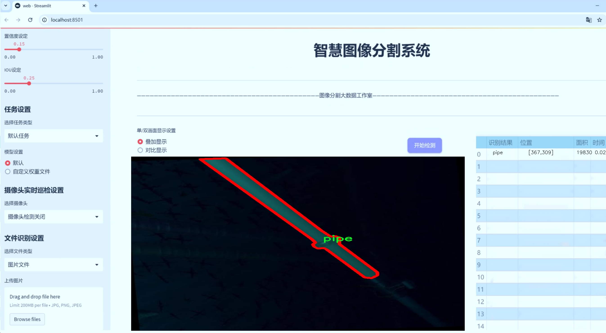
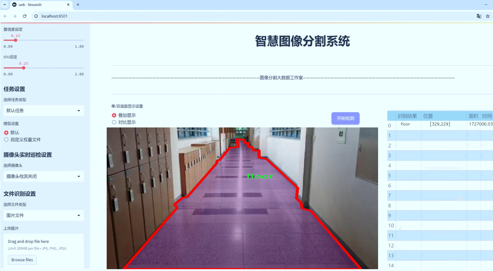
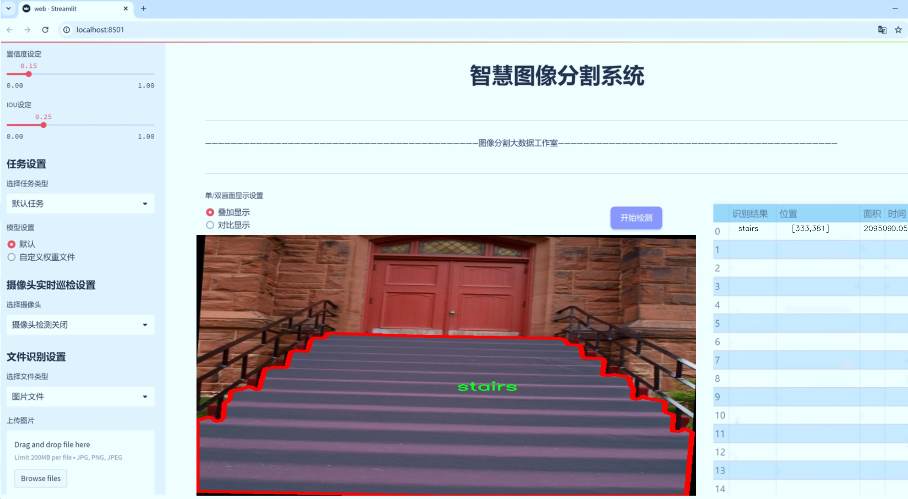
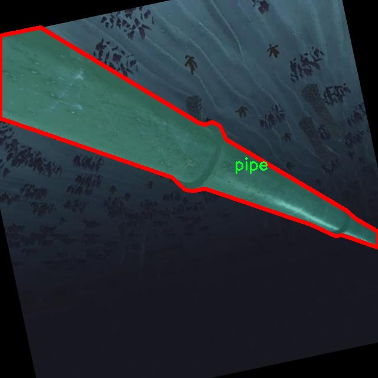
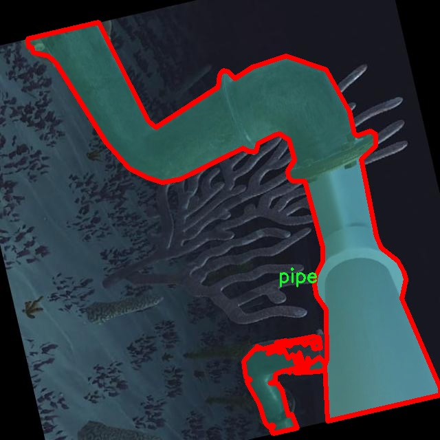
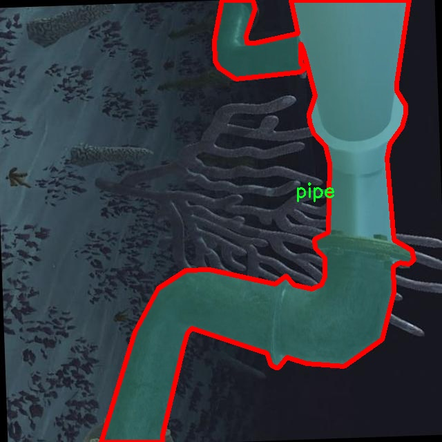
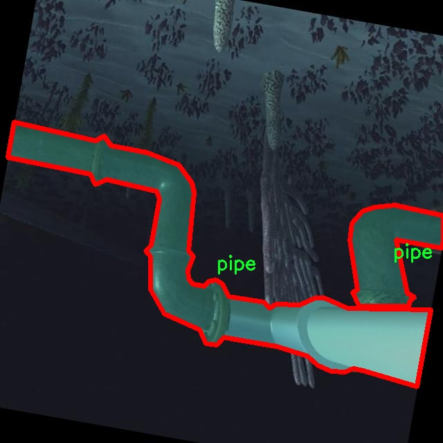
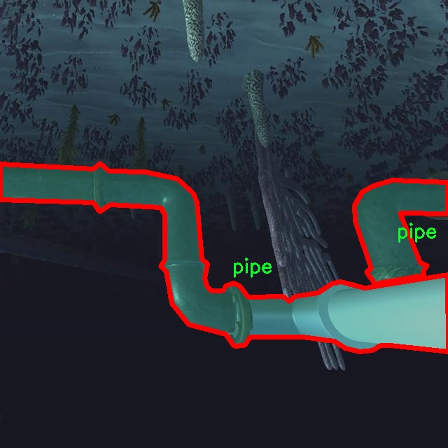

# 建筑工地物件场景图像分割系统源码＆数据集分享
 [yolov8-seg-C2f-RFCAConv＆yolov8-seg-bifpn等50+全套改进创新点发刊_一键训练教程_Web前端展示]

### 1.研究背景与意义

项目参考[ILSVRC ImageNet Large Scale Visual Recognition Challenge](https://gitee.com/YOLOv8_YOLOv11_Segmentation_Studio/projects)

项目来源[AAAI Global Al lnnovation Contest](https://kdocs.cn/l/cszuIiCKVNis)

研究背景与意义

随着城市化进程的加快，建筑工地的数量与规模不断增加，建筑行业面临着安全管理、资源配置及工期控制等多重挑战。建筑工地的复杂性不仅体现在施工流程的多样性上，还体现在工地环境中各种物体的动态变化上。为了提高建筑工地的管理效率，确保施工安全，基于计算机视觉的图像处理技术逐渐成为研究的热点。尤其是物体检测与分割技术的进步，为工地的智能监控、资源管理和安全预警提供了新的解决方案。

YOLO（You Only Look Once）系列模型因其高效的实时检测能力而受到广泛关注。YOLOv8作为该系列的最新版本，具备更高的检测精度和更快的处理速度，能够在复杂的场景中实现对多种物体的准确识别。然而，传统的YOLOv8模型在建筑工地的特定应用中仍存在一些不足，尤其是在处理多类别物体的分割任务时。为此，针对建筑工地场景的特征，改进YOLOv8模型以实现更高效的物件场景图像分割，具有重要的理论和实践意义。

本研究将利用一个包含2700张图像的建筑工地数据集，该数据集涵盖了8个类别的物体，包括电梯、楼层、走廊、人、土堆、障碍物、管道和楼梯。这些类别不仅代表了建筑工地中常见的物体类型，还反映了工地环境的复杂性和多样性。通过对这些物体进行实例分割，可以更准确地识别和定位工地中的各类物体，为后续的智能监控和管理提供基础数据支持。

改进YOLOv8模型的研究意义在于，不仅可以提升物体检测的准确性，还能够增强模型在复杂场景下的鲁棒性。建筑工地环境中，光照变化、遮挡现象以及物体的多样性都会对检测效果产生影响。因此，研究如何通过改进模型结构、优化训练策略和增强数据集来提升分割效果，将为建筑工地的智能化管理提供更为有效的技术手段。

此外，基于改进YOLOv8的建筑工地物件场景图像分割系统的构建，能够为建筑行业的数字化转型提供重要的技术支撑。通过实时监控和数据分析，管理者可以及时发现工地上的安全隐患，优化资源配置，减少施工过程中的浪费，提高整体施工效率。这不仅有助于提升建筑项目的经济效益，也为工人的安全保障提供了有力的支持。

综上所述，基于改进YOLOv8的建筑工地物件场景图像分割系统的研究，不仅具有重要的学术价值，还在实际应用中展现出广阔的前景。通过深入探讨和解决建筑工地图像分割中的关键问题，将为推动建筑行业的智能化发展做出积极贡献。

### 2.图片演示







##### 注意：由于此博客编辑较早，上面“2.图片演示”和“3.视频演示”展示的系统图片或者视频可能为老版本，新版本在老版本的基础上升级如下：（实际效果以升级的新版本为准）

  （1）适配了YOLOV8的“目标检测”模型和“实例分割”模型，通过加载相应的权重（.pt）文件即可自适应加载模型。

  （2）支持“图片识别”、“视频识别”、“摄像头实时识别”三种识别模式。

  （3）支持“图片识别”、“视频识别”、“摄像头实时识别”三种识别结果保存导出，解决手动导出（容易卡顿出现爆内存）存在的问题，识别完自动保存结果并导出到tempDir中。

  （4）支持Web前端系统中的标题、背景图等自定义修改，后面提供修改教程。

  另外本项目提供训练的数据集和训练教程,暂不提供权重文件（best.pt）,需要您按照教程进行训练后实现图片演示和Web前端界面演示的效果。

### 3.视频演示

[3.1 视频演示](https://www.bilibili.com/video/BV1TTyYYWEBN/)

### 4.数据集信息展示

##### 4.1 本项目数据集详细数据（类别数＆类别名）

nc: 7
names: ['elevator', 'floor', 'human', 'mood', 'obstacle', 'pipe', 'stairs']


##### 4.2 本项目数据集信息介绍

数据集信息展示

在现代建筑工地的管理与安全监控中，图像分割技术的应用日益显得重要。为此，我们构建了一个名为“construction site”的数据集，旨在为改进YOLOv8-seg的建筑工地物件场景图像分割系统提供高质量的训练数据。该数据集涵盖了多种建筑工地常见的物体类别，包含七个主要类别，分别为电梯（elevator）、地面（floor）、人类（human）、情绪（mood）、障碍物（obstacle）、管道（pipe）和楼梯（stairs）。这些类别的选择不仅反映了建筑工地的实际场景，还考虑到了工地安全和作业效率的多重需求。

在数据集的构建过程中，我们通过精心的采集和标注，确保每个类别的样本数量和质量都达到训练深度学习模型的标准。电梯作为工地中重要的垂直运输工具，其准确的识别对于工人和材料的安全运输至关重要。地面则是工地活动的基础，准确的地面分割有助于评估施工进度和质量。人类这一类别的标注则旨在提高工地的安全监控能力，确保工人在施工过程中的安全性。情绪这一类别的引入则是为了通过分析工人状态，优化工地管理和心理健康监测。

障碍物的识别对于确保工地安全至关重要，及时发现并处理障碍物可以有效减少事故的发生。管道的分割不仅有助于施工人员的工作安排，也为后续的维护和检查提供了便利。楼梯作为工地内重要的垂直通道，其准确的识别和分割能够帮助工人更安全地进行上下移动，减少因不当操作导致的意外。

该数据集的构建不仅注重样本的多样性，还力求在不同的光照、天气和视角条件下进行采集，以增强模型的鲁棒性。通过对不同工地环境的综合考虑，我们希望“construction site”数据集能够为YOLOv8-seg模型的训练提供丰富的场景变换，提升其在实际应用中的表现。

在数据标注方面，我们采用了专业的标注工具，确保每个类别的边界框和分割掩码都准确无误。每个图像的标注信息都经过多轮审核，以确保数据的高质量和高可靠性。此外，为了便于后续的研究和应用，我们还为数据集提供了详细的文档说明，包括类别定义、标注规范以及数据采集的具体流程。

通过“construction site”数据集的构建与应用，我们期望能够推动建筑工地图像分割技术的发展，提高工地的安全管理水平和工作效率。随着深度学习技术的不断进步，该数据集将为研究人员和工程师提供一个强有力的工具，助力他们在建筑工地的智能化管理和安全监控领域取得更大的突破。











### 5.全套项目环境部署视频教程（零基础手把手教学）

[5.1 环境部署教程链接（零基础手把手教学）](https://www.bilibili.com/video/BV1jG4Ve4E9t/?vd_source=bc9aec86d164b67a7004b996143742dc)


[5.2 安装Python虚拟环境创建和依赖库安装视频教程链接（零基础手把手教学）](https://www.bilibili.com/video/BV1nA4VeYEze/?vd_source=bc9aec86d164b67a7004b996143742dc)

### 6.手把手YOLOV8-seg训练视频教程（零基础小白有手就能学会）

[6.1 手把手YOLOV8-seg训练视频教程（零基础小白有手就能学会）](https://www.bilibili.com/video/BV1cA4VeYETe/?vd_source=bc9aec86d164b67a7004b996143742dc)


按照上面的训练视频教程链接加载项目提供的数据集，运行train.py即可开始训练



     Epoch   gpu_mem       box       obj       cls    labels  img_size
     1/200     0G   0.01576   0.01955  0.007536        22      1280: 100%|██████████| 849/849 [14:42<00:00,  1.04s/it]
               Class     Images     Labels          P          R     mAP@.5 mAP@.5:.95: 100%|██████████| 213/213 [01:14<00:00,  2.87it/s]
                 all       3395      17314      0.994      0.957      0.0957      0.0843

     Epoch   gpu_mem       box       obj       cls    labels  img_size
     2/200     0G   0.01578   0.01923  0.007006        22      1280: 100%|██████████| 849/849 [14:44<00:00,  1.04s/it]
               Class     Images     Labels          P          R     mAP@.5 mAP@.5:.95: 100%|██████████| 213/213 [01:12<00:00,  2.95it/s]
                 all       3395      17314      0.996      0.956      0.0957      0.0845

     Epoch   gpu_mem       box       obj       cls    labels  img_size
     3/200     0G   0.01561    0.0191  0.006895        27      1280: 100%|██████████| 849/849 [10:56<00:00,  1.29it/s]
               Class     Images     Labels          P          R     mAP@.5 mAP@.5:.95: 100%|███████   | 187/213 [00:52<00:00,  4.04it/s]
                 all       3395      17314      0.996      0.957      0.0957      0.0845


### 7.50+种全套YOLOV8-seg创新点代码加载调参视频教程（一键加载写好的改进模型的配置文件）

[7.1 50+种全套YOLOV8-seg创新点代码加载调参视频教程（一键加载写好的改进模型的配置文件）](https://www.bilibili.com/video/BV1Hw4VePEXv/?vd_source=bc9aec86d164b67a7004b996143742dc)

### 8.YOLOV8-seg图像分割算法原理

原始YOLOV8-seg算法原理

YOLOv8-seg是Ultralytics公司在2023年推出的YOLO系列最新版本，旨在进一步提升目标检测和图像分割的性能。该算法基于YOLOv8的核心架构，采用了一系列创新的设计理念和技术改进，使其在复杂的视觉任务中表现出色。YOLOv8-seg不仅继承了YOLO系列一贯的高效性和准确性，还在特征提取、特征融合和输出阶段进行了深度优化，特别是在图像分割任务中，展现了更强的适应性和精度。

首先，YOLOv8-seg的输入模块采用了640x640的标准输入尺寸，但在实际应用中，算法能够自适应地调整输入图像的长宽比。这一自适应缩放策略不仅提高了模型的推理速度，还有效减少了填充带来的信息冗余。此外，YOLOv8-seg在训练阶段引入了Mosaic数据增强技术，通过将四张不同的图像随机缩放并拼接，生成新的训练样本。这种增强方式使得模型能够学习到更多的上下文信息，增强了其对不同目标位置和周围环境的适应能力，从而提升了分割精度。

在主干网络部分，YOLOv8-seg采用了CSP结构，利用C2f模块替代了YOLOv5中的C3模块。C2f模块通过并行化更多的梯度流分支，能够在保持轻量化的同时，获取更丰富的特征信息。这种设计使得YOLOv8-seg在特征提取时，能够更有效地捕捉到图像中的细节，尤其是在处理复杂背景和小目标时，展现出更高的分割精度。

YOLOv8-seg的颈部网络采用了PAN-FPN结构，这一结构通过多尺度特征融合，进一步增强了模型对不同尺度目标的检测能力。通过上采样和下采样的结合，PAN-FPN能够有效地整合来自不同层次的特征信息，使得最终的特征图更加丰富和全面。这一特征融合策略在图像分割任务中尤为重要，因为它能够帮助模型更好地理解目标的形状和边界，从而提高分割的准确性。

在输出阶段，YOLOv8-seg引入了解耦头结构（Decoupled Head），将目标检测和分类任务进行分离。这一设计使得模型在进行目标定位和类别预测时，能够更加专注于各自的任务，避免了传统耦合头结构中可能出现的性能瓶颈。此外，YOLOv8-seg在损失函数的设计上也进行了创新，采用了Distribution Focal Loss（DFL）和Complete Intersection over Union（CIoU）损失函数，以提高模型对小目标的感知能力和定位精度。

YOLOv8-seg的另一大亮点在于其采用了Anchor-Free的检测方式。这一方法不再依赖于预设的锚框，而是将目标检测转化为关键点检测，极大地简化了模型的结构。Anchor-Free的设计不仅提高了模型的灵活性，还降低了计算复杂度，使得YOLOv8-seg在处理多样化的目标时，能够展现出更高的准确性和速度。

综上所述，YOLOv8-seg通过一系列创新的设计和优化，在目标检测和图像分割任务中取得了显著的进展。其自适应输入处理、改进的主干网络、先进的特征融合策略以及解耦的输出结构，使得该算法在面对复杂的视觉场景时，能够有效地提升检测和分割的性能。随着YOLOv8-seg的不断发展和应用，预计其将在更多实际场景中发挥重要作用，推动计算机视觉领域的进一步发展。


### 9.系统功能展示（检测对象为举例，实际内容以本项目数据集为准）

图9.1.系统支持检测结果表格显示

  图9.2.系统支持置信度和IOU阈值手动调节

  图9.3.系统支持自定义加载权重文件best.pt(需要你通过步骤5中训练获得)

  图9.4.系统支持摄像头实时识别

  图9.5.系统支持图片识别

  图9.6.系统支持视频识别

  图9.7.系统支持识别结果文件自动保存

  图9.8.系统支持Excel导出检测结果数据


### 10.50+种全套YOLOV8-seg创新点原理讲解（非科班也可以轻松写刊发刊，V11版本正在科研待更新）

#### 10.1 由于篇幅限制，每个创新点的具体原理讲解就不一一展开，具体见下列网址中的创新点对应子项目的技术原理博客网址【Blog】：


[10.1 50+种全套YOLOV8-seg创新点原理讲解链接](https://gitee.com/qunmasj/good)

#### 10.2 部分改进模块原理讲解(完整的改进原理见上图和技术博客链接)【如果此小节的图加载失败可以通过CSDN或者Github搜索该博客的标题访问原始博客，原始博客图片显示正常】

### YOLOv8简介
YoloV8模型结构
YOLOv3之前的所有YOLO对象检测模型都是用C语言编写的，并使用了Darknet框架，Ultralytics发布了第一个使用PyTorch框架实现的YOLO (YOLOv3)；YOLOv3之后，Ultralytics发布了YOLOv5，在2023年1月，Ultralytics发布了YOLOv8，包含五个模型，用于检测、分割和分类。 YOLOv8 Nano是其中最快和最小的，而YOLOv8 Extra Large (YOLOv8x)是其中最准确但最慢的，具体模型见后续的图。

YOLOv8附带以下预训练模型:

目标检测在图像分辨率为640的COCO检测数据集上进行训练。
实例分割在图像分辨率为640的COCO分割数据集上训练。
图像分类模型在ImageNet数据集上预训练，图像分辨率为224。
YOLOv8 概述
具体到 YOLOv8 算法，其核心特性和改动可以归结为如下：

提供了一个全新的SOTA模型（state-of-the-art model），包括 P5 640 和 P6 1280 分辨率的目标检测网络和基于YOLACT的实例分割模型。和 YOLOv5 一样，基于缩放系数也提供了 N/S/M/L/X 尺度的不同大小模型，用于满足不同场景需求
骨干网络和 Neck 部分可能参考了 YOLOv7 ELAN 设计思想，将 YOLOv5 的 C3 结构换成了梯度流更丰富的 C2f 结构，并对不同尺度模型调整了不同的通道数，属于对模型结构精心微调，不再是一套参数应用所有模型，大幅提升了模型性能。
Head 部分相比 YOLOv5 改动较大，换成了目前主流的解耦头结构，将分类和检测头分离，同时也从Anchor-Based 换成了 Anchor-Free
Loss 计算方面采用了TaskAlignedAssigner正样本分配策略，并引入了Distribution Focal Loss
训练的数据增强部分引入了 YOLOX 中的最后 10 epoch 关闭 Mosiac 增强的操作，可以有效地提升精度


### HRNet V2简介
现在设计高低分辨率融合的思路主要有以下四种：


（a）对称结构。如U-Net、Hourglass等，都是先下采样再上采样，上下采样过程对称。

（b）级联金字塔。如refinenet等，高低分辨率融合时经过卷积处理。

（c）简单的baseline，用转职卷积进行上采样。

（d）扩张卷积。如deeplab等，增大感受野，减少下采样次数，可以无需跳层连接直接进行上采样。

（b）（c）都是使用复杂一些的网络进行下采样（如resnet、vgg），再用轻量级的网络进行上采样。

HRNet V1是在（b）的基础上进行改进，从头到尾保持大的分辨率表示。然而HRNet V1仅是用在姿态估计领域的，HRNet V2对它做小小的改进可以使其适用于更广的视觉任务。这一改进仅仅增加了较小的计算开销，但却提升了较大的准确度。

#### 网络结构图：


这个结构图简洁明了就不多介绍了，首先图2的输入是已经经过下采样四倍的feature map，横向的conv block指的是basicblock 或 bottleblock，不同分辨率之间的多交叉线部分是multi-resolution convolution（多分辨率组卷积）。

到此为止HRNet V2和HRNet V1是完全一致的。

区别之处在于这个基网络上加的一个head：


图3介绍的是接在图2最后的head。（a）是HRNet V1的头，很明显他只用了大分辨率的特征图。（b）（c）是HRNet V2的创新点，（b）用与语义分割，（c）用于目标检测。除此之外作者还在实验部分介绍了用于分类的head，如图4所示。


#### 多分辨率block：


一个多分辨率block由多分辨率组卷积（a）和多分辨率卷积（b）组成。（c）是一个正常卷积的展开，（b）的灵感来源于（c）。代码中（a）部分由Bottleneck和BasicBlock组成。

多分辨率卷积和正常卷积的区别：（1）多分辨率卷积中，每个通道的subset的分辨率都不一样。（2）通道之间的连接如果是降分辨率，则用的是3x3的2stride的卷积，如果是升分辨率，用的是双线性最邻近插值上采样。


### 11.项目核心源码讲解（再也不用担心看不懂代码逻辑）

#### 11.1 ultralytics\utils\callbacks\neptune.py

以下是经过简化和注释的核心代码部分，保留了与NeptuneAI集成相关的功能：

```python
# 导入必要的库
from ultralytics.utils import LOGGER, SETTINGS, TESTS_RUNNING

# 尝试导入NeptuneAI库并进行初始化
try:
    assert not TESTS_RUNNING  # 确保不在测试模式下
    assert SETTINGS['neptune'] is True  # 确保Neptune集成已启用
    import neptune
    from neptune.types import File

    assert hasattr(neptune, '__version__')  # 确保Neptune版本存在

    run = None  # NeptuneAI实验记录实例

except (ImportError, AssertionError):
    neptune = None  # 如果导入失败，设置neptune为None


def _log_scalars(scalars, step=0):
    """将标量数据记录到NeptuneAI实验记录器中。"""
    if run:  # 如果Neptune已初始化
        for k, v in scalars.items():
            run[k].append(value=v, step=step)  # 记录每个标量


def _log_images(imgs_dict, group=''):
    """将图像记录到NeptuneAI实验记录器中。"""
    if run:  # 如果Neptune已初始化
        for k, v in imgs_dict.items():
            run[f'{group}/{k}'].upload(File(v))  # 上传每个图像


def on_pretrain_routine_start(trainer):
    """在训练例程开始前调用的回调函数。"""
    try:
        global run
        # 初始化Neptune运行
        run = neptune.init_run(project=trainer.args.project or 'YOLOv8', name=trainer.args.name, tags=['YOLOv8'])
        # 记录超参数配置
        run['Configuration/Hyperparameters'] = {k: '' if v is None else v for k, v in vars(trainer.args).items()}
    except Exception as e:
        LOGGER.warning(f'WARNING ⚠️ NeptuneAI安装但未正确初始化，未记录此运行。{e}')


def on_train_epoch_end(trainer):
    """每个训练周期结束时调用的回调函数。"""
    # 记录训练损失和学习率
    _log_scalars(trainer.label_loss_items(trainer.tloss, prefix='train'), trainer.epoch + 1)
    _log_scalars(trainer.lr, trainer.epoch + 1)
    # 在第一个周期结束时记录训练图像
    if trainer.epoch == 1:
        _log_images({f.stem: str(f) for f in trainer.save_dir.glob('train_batch*.jpg')}, 'Mosaic')


def on_val_end(validator):
    """每次验证结束时调用的回调函数。"""
    if run:
        # 记录验证图像
        _log_images({f.stem: str(f) for f in validator.save_dir.glob('val*.jpg')}, 'Validation')


def on_train_end(trainer):
    """训练结束时调用的回调函数。"""
    if run:
        # 记录最终结果和模型
        files = [
            'results.png', 'confusion_matrix.png', 'confusion_matrix_normalized.png',
            *(f'{x}_curve.png' for x in ('F1', 'PR', 'P', 'R'))]
        files = [(trainer.save_dir / f) for f in files if (trainer.save_dir / f).exists()]  # 过滤存在的文件
        for f in files:
            _log_plot(title=f.stem, plot_path=f)  # 记录每个图表
        # 记录最终模型
        run[f'weights/{trainer.args.name or trainer.args.task}/{str(trainer.best.name)}'].upload(File(str(trainer.best)))


# 定义回调函数字典
callbacks = {
    'on_pretrain_routine_start': on_pretrain_routine_start,
    'on_train_epoch_end': on_train_epoch_end,
    'on_val_end': on_val_end,
    'on_train_end': on_train_end} if neptune else {}
```

### 代码说明：
1. **NeptuneAI集成**：代码首先尝试导入NeptuneAI库并进行初始化，以便记录实验数据。如果导入失败，则将`neptune`设置为`None`，后续的记录操作将被跳过。
  
2. **记录函数**：
   - `_log_scalars`：用于记录标量数据（如损失和学习率）。
   - `_log_images`：用于记录图像数据（如训练和验证图像）。

3. **回调函数**：
   - `on_pretrain_routine_start`：在训练开始前初始化Neptune并记录超参数。
   - `on_train_epoch_end`：在每个训练周期结束时记录损失和学习率，并在第一个周期结束时记录训练图像。
   - `on_val_end`：在每次验证结束时记录验证图像。
   - `on_train_end`：在训练结束时记录最终结果和模型。

4. **回调字典**：根据是否成功导入Neptune，定义相应的回调函数字典，以便在训练过程中调用。

这个文件是Ultralytics YOLO项目中的一个回调模块，主要用于与NeptuneAI进行集成，以便在训练过程中记录和可视化实验数据。代码首先导入了一些必要的模块和库，并进行了一些初始化和错误处理。

在导入部分，代码首先尝试导入Neptune库，并检查一些条件，比如是否正在运行测试（TESTS_RUNNING）以及Neptune集成是否启用（SETTINGS['neptune']）。如果这些条件不满足，代码会将neptune设置为None，以避免后续代码出错。

接下来，定义了一些私有函数，用于记录不同类型的数据到NeptuneAI。`_log_scalars`函数用于记录标量数据，例如损失值和学习率；`_log_images`函数用于记录图像数据，比如训练过程中的样本图像；`_log_plot`函数用于记录绘图数据，它会读取指定路径的图像并上传到Neptune。

文件中还定义了一些回调函数，这些函数会在训练的不同阶段被调用。`on_pretrain_routine_start`函数在训练开始前被调用，用于初始化Neptune的运行实例，并记录超参数配置。`on_train_epoch_end`函数在每个训练周期结束时被调用，记录训练损失和学习率，并在第一个周期结束时记录训练批次的图像。`on_fit_epoch_end`函数在每个适应周期结束时被调用，记录模型的配置信息和指标。`on_val_end`函数在每次验证结束时被调用，记录验证集的图像。最后，`on_train_end`函数在训练结束时被调用，记录最终的结果、混淆矩阵和精度-召回曲线，并上传最佳模型的权重。

最后，代码将这些回调函数组织成一个字典，如果Neptune库可用，则可以通过该字典在训练过程中调用相应的回调函数。这种设计使得代码结构清晰，易于扩展和维护，同时也为模型训练提供了强大的可视化和监控能力。

#### 11.2 ultralytics\models\nas\val.py

以下是经过简化和注释的核心代码部分：

```python
import torch
from ultralytics.utils import ops

class NASValidator:
    """
    Ultralytics YOLO NAS 验证器，用于目标检测的后处理。

    该类用于处理 YOLO NAS 模型生成的原始预测结果，通过非极大值抑制（NMS）来去除重叠和低置信度的框，
    最终生成最终的检测结果。
    """

    def postprocess(self, preds_in):
        """对预测输出应用非极大值抑制（NMS）。"""
        # 将预测框从 xyxy 格式转换为 xywh 格式
        boxes = ops.xyxy2xywh(preds_in[0][0])
        
        # 将框和置信度合并，并调整维度顺序
        preds = torch.cat((boxes, preds_in[0][1]), -1).permute(0, 2, 1)
        
        # 应用非极大值抑制，去除重叠框
        return ops.non_max_suppression(preds,
                                       self.args.conf,  # 置信度阈值
                                       self.args.iou,   # IoU 阈值
                                       labels=self.lb,  # 多标签 NMS 的标签
                                       multi_label=False,  # 是否支持多标签
                                       agnostic=self.args.single_cls,  # 是否单类
                                       max_det=self.args.max_det,  # 最大检测框数量
                                       max_time_img=0.5)  # 每张图像的最大处理时间
```

### 代码说明：
1. **导入必要的库**：
   - `torch`：用于张量操作。
   - `ops`：包含用于处理预测结果的操作函数。

2. **NASValidator 类**：
   - 该类用于处理 YOLO NAS 模型的预测结果，主要通过非极大值抑制（NMS）来优化检测框。

3. **postprocess 方法**：
   - 输入参数 `preds_in` 是模型的原始预测结果。
   - 使用 `ops.xyxy2xywh` 将预测框的坐标格式从 `(x1, y1, x2, y2)` 转换为 `(x_center, y_center, width, height)` 格式。
   - 将转换后的框与置信度合并，并调整维度顺序，以便于后续处理。
   - 调用 `ops.non_max_suppression` 方法，应用 NMS 来去除重叠的检测框，返回最终的检测结果。此方法使用了一些参数，如置信度阈值、IoU 阈值等，以控制检测的质量和数量。

这个程序文件定义了一个名为 `NASValidator` 的类，它是用于 YOLO NAS（You Only Look Once Neural Architecture Search）模型的对象检测验证器。该类继承自 `DetectionValidator`，主要用于处理 YOLO NAS 模型生成的原始预测结果。其核心功能是执行非极大值抑制（Non-Maximum Suppression, NMS），以去除重叠和低置信度的框，从而最终生成有效的检测结果。

在这个类中，有几个重要的属性和方法。首先，`args` 属性是一个命名空间（Namespace），它包含了用于后处理的各种配置，例如置信度和交并比（IoU）阈值。`lb` 属性是一个可选的张量，用于多标签非极大值抑制。

`postprocess` 方法是这个类的关键功能，它接受原始预测结果 `preds_in` 作为输入，并对其进行处理。具体来说，方法首先将预测框的坐标从 xyxy 格式转换为 xywh 格式，然后将框的坐标与相应的置信度进行拼接，并调整维度。接着，调用 `ops.non_max_suppression` 函数执行非极大值抑制，去除重叠的框，并根据配置的阈值返回最终的检测结果。

使用示例中展示了如何使用 `NASValidator`。首先导入 `NAS` 模块，创建一个 YOLO NAS 模型实例，然后获取该模型的验证器。假设已经获得了原始预测结果 `raw_preds`，可以通过调用 `validator.postprocess(raw_preds)` 来获取最终的预测结果。

需要注意的是，这个类通常不会被直接实例化，而是在 `NAS` 类内部使用。整体上，这个文件为 YOLO NAS 模型的后处理提供了必要的工具，确保检测结果的准确性和有效性。

#### 11.3 ultralytics\hub\utils.py

以下是经过简化并添加详细中文注释的核心代码部分：

```python
import os
import platform
import random
import sys
import threading
import time
from pathlib import Path
import requests
from ultralytics.utils import (ENVIRONMENT, LOGGER, ONLINE, RANK, SETTINGS, TESTS_RUNNING, TQDM, TryExcept, __version__,
                               colorstr, get_git_origin_url, is_colab, is_git_dir, is_pip_package)
from ultralytics.utils.downloads import GITHUB_ASSETS_NAMES

# 定义一些常量
PREFIX = colorstr('Ultralytics HUB: ')
HELP_MSG = '如果此问题持续存在，请访问 https://github.com/ultralytics/hub/issues 寻求帮助。'
HUB_API_ROOT = os.environ.get('ULTRALYTICS_HUB_API', 'https://api.ultralytics.com')
HUB_WEB_ROOT = os.environ.get('ULTRALYTICS_HUB_WEB', 'https://hub.ultralytics.com')

def smart_request(method, url, retry=3, timeout=30, thread=True, verbose=True, progress=False, **kwargs):
    """
    使用'requests'库进行HTTP请求，支持重试和超时设置。

    参数:
        method (str): HTTP请求方法，例如'GET'或'POST'。
        url (str): 请求的URL。
        retry (int): 重试次数，默认为3。
        timeout (int): 超时时间（秒），默认为30。
        thread (bool): 是否在单独的线程中执行请求，默认为True。
        verbose (bool): 是否在控制台打印信息，默认为True。
        progress (bool): 是否在请求过程中显示进度条，默认为False。
        **kwargs (dict): 传递给requests函数的其他关键字参数。

    返回:
        (requests.Response): HTTP响应对象。如果请求在单独线程中执行，则返回None。
    """
    retry_codes = (408, 500)  # 需要重试的HTTP状态码

    @TryExcept(verbose=verbose)
    def func(func_method, func_url, **func_kwargs):
        """执行HTTP请求，支持重试和超时设置。"""
        r = None  # 响应对象
        t0 = time.time()  # 记录开始时间
        for i in range(retry + 1):
            if (time.time() - t0) > timeout:  # 检查是否超时
                break
            r = requests.request(func_method, func_url, **func_kwargs)  # 执行请求
            if r.status_code < 300:  # 如果状态码在2xx范围内，表示成功
                break
            if i == 0 and verbose:
                LOGGER.warning(f'{PREFIX}请求失败，状态码: {r.status_code}')  # 打印警告信息
            time.sleep(2 ** i)  # 指数退避策略
        return r

    args = method, url
    if thread:
        threading.Thread(target=func, args=args, kwargs=kwargs, daemon=True).start()  # 在新线程中执行
    else:
        return func(*args, **kwargs)  # 在当前线程中执行

class Events:
    """
    用于收集匿名事件分析的类。事件分析在设置中sync=True时启用，sync=False时禁用。

    属性:
        url (str): 发送匿名事件的URL。
        rate_limit (float): 发送事件的速率限制（秒）。
        metadata (dict): 包含环境元数据的字典。
        enabled (bool): 根据特定条件启用或禁用事件收集的标志。
    """

    url = 'https://www.google-analytics.com/mp/collect?measurement_id=G-X8NCJYTQXM&api_secret=QLQrATrNSwGRFRLE-cbHJw'

    def __init__(self):
        """初始化Events对象，设置默认值。"""
        self.events = []  # 事件列表
        self.rate_limit = 60.0  # 速率限制（秒）
        self.t = 0.0  # 速率限制计时器（秒）
        self.metadata = {
            'cli': Path(sys.argv[0]).name == 'yolo',
            'install': 'git' if is_git_dir() else 'pip' if is_pip_package() else 'other',
            'python': '.'.join(platform.python_version_tuple()[:2]),  # Python版本
            'version': __version__,
            'env': ENVIRONMENT,
            'session_id': round(random.random() * 1E15),  # 随机会话ID
            'engagement_time_msec': 1000
        }
        self.enabled = \
            SETTINGS['sync'] and \
            RANK in (-1, 0) and \
            not TESTS_RUNNING and \
            ONLINE and \
            (is_pip_package() or get_git_origin_url() == 'https://github.com/ultralytics/ultralytics.git')

    def __call__(self, cfg):
        """
        尝试将新事件添加到事件列表，并在达到速率限制时发送事件。

        参数:
            cfg (IterableSimpleNamespace): 包含模式和任务信息的配置对象。
        """
        if not self.enabled:
            return  # 如果事件收集被禁用，则不执行任何操作

        # 尝试添加事件
        if len(self.events) < 25:  # 事件列表限制为25个事件
            params = {
                **self.metadata, 'task': cfg.task,
                'model': cfg.model if cfg.model in GITHUB_ASSETS_NAMES else 'custom'
            }
            self.events.append({'name': cfg.mode, 'params': params})

        # 检查速率限制
        t = time.time()
        if (t - self.t) < self.rate_limit:
            return  # 如果时间未超过速率限制，则不发送事件

        # 超过速率限制，发送事件
        data = {'client_id': SETTINGS['uuid'], 'events': self.events}  # 包含事件的请求数据
        smart_request('post', self.url, json=data, retry=0, verbose=False)  # 发送POST请求

        # 重置事件列表和速率限制计时器
        self.events = []
        self.t = t

# 初始化事件收集
events = Events()
```

### 代码核心部分解释：
1. **smart_request 函数**：用于执行HTTP请求，支持重试机制和超时设置。可以选择在新线程中执行请求，并在请求过程中显示进度条。
2. **Events 类**：用于收集和发送匿名事件分析数据。包含事件的元数据和速率限制机制，确保在一定时间内不会发送过多的事件。
3. **事件收集的启用条件**：通过检查环境变量和设置，决定是否启用事件收集。

这个程序文件是Ultralytics YOLO项目中的一个工具模块，主要用于处理与网络请求和事件分析相关的功能。文件的开头导入了一些必要的库和模块，包括操作系统、网络请求、路径处理等。接下来定义了一些常量和环境变量，例如API的根地址和Web根地址。

文件中包含几个主要的函数和一个类。首先，`request_with_credentials`函数用于在Google Colab环境中进行带有凭证的AJAX请求。它会检查当前环境是否为Colab，如果不是，则抛出一个错误。该函数通过JavaScript代码向指定的URL发送POST请求，并返回响应数据。

接下来是`requests_with_progress`函数，它用于执行HTTP请求，并在下载过程中显示进度条。该函数支持多种HTTP方法（如GET和POST），并通过`TQDM`库显示下载进度。

`smart_request`函数是一个更为复杂的请求处理函数，支持重试机制和超时设置。它会在请求失败时进行指数退避重试，最多重试指定次数。该函数还可以选择在单独的线程中执行请求，并在请求过程中显示进度条。

最后，`Events`类用于收集匿名事件分析数据。它会在特定条件下启用事件收集，并在达到速率限制时发送事件数据。类的构造函数初始化了一些属性，包括事件列表、速率限制和元数据。`__call__`方法尝试将新事件添加到事件列表中，并在达到速率限制时发送事件数据。

文件的最后部分创建了一个`Events`类的实例，以便在后续代码中使用。整体来看，这个模块提供了网络请求的封装和事件分析的功能，便于在Ultralytics YOLO项目中进行数据收集和处理。

#### 11.4 ultralytics\models\fastsam\val.py

```python
# 导入必要的模块
from ultralytics.models.yolo.segment import SegmentationValidator
from ultralytics.utils.metrics import SegmentMetrics

class FastSAMValidator(SegmentationValidator):
    """
    自定义验证类，用于在Ultralytics YOLO框架中进行快速SAM（Segment Anything Model）分割。

    该类扩展了SegmentationValidator类，专门定制了快速SAM的验证过程。它将任务设置为'segment'，
    并使用SegmentMetrics进行评估。此外，为了避免在验证过程中出现错误，禁用了绘图功能。
    """

    def __init__(self, dataloader=None, save_dir=None, pbar=None, args=None, _callbacks=None):
        """
        初始化FastSAMValidator类，将任务设置为'segment'并将指标设置为SegmentMetrics。

        参数：
            dataloader (torch.utils.data.DataLoader): 用于验证的数据加载器。
            save_dir (Path, optional): 保存结果的目录。
            pbar (tqdm.tqdm): 用于显示进度的进度条。
            args (SimpleNamespace): 验证器的配置。
            _callbacks (dict): 用于存储各种回调函数的字典。

        注意：
            在此类中禁用了ConfusionMatrix和其他相关指标的绘图，以避免错误。
        """
        # 调用父类的初始化方法
        super().__init__(dataloader, save_dir, pbar, args, _callbacks)
        
        # 设置任务类型为分割
        self.args.task = 'segment'
        
        # 禁用绘图功能，以避免在验证过程中出现错误
        self.args.plots = False
        
        # 初始化分割指标，用于评估
        self.metrics = SegmentMetrics(save_dir=self.save_dir, on_plot=self.on_plot)
``` 

### 代码核心部分解释：
1. **类定义**：`FastSAMValidator` 继承自 `SegmentationValidator`，用于快速SAM分割的自定义验证。
2. **初始化方法**：在初始化时，设置任务类型为分割，并禁用绘图功能，以避免在验证过程中出现错误。
3. **指标设置**：使用 `SegmentMetrics` 来评估分割结果，并将保存目录传入以存储验证结果。

这个程序文件是Ultralytics YOLO框架中的一个自定义验证类，名为`FastSAMValidator`，主要用于快速SAM（Segment Anything Model）分割任务的验证。该类继承自`SegmentationValidator`，并对验证过程进行了特定的定制。

在类的文档字符串中，首先说明了该类的功能和目的。它设置了任务类型为“分割”，并使用`SegmentMetrics`进行评估。此外，为了避免在验证过程中出现错误，该类禁用了绘图功能。

构造函数`__init__`用于初始化`FastSAMValidator`类。它接受多个参数，包括数据加载器`dataloader`、结果保存目录`save_dir`、进度条对象`pbar`、配置参数`args`以及回调函数字典`_callbacks`。在构造函数中，调用了父类的构造函数以初始化继承的属性，并将任务类型设置为“segment”。同时，将绘图功能禁用，以避免在验证过程中出现与混淆矩阵等相关的错误。最后，创建了一个`SegmentMetrics`实例，用于保存验证结果并进行相应的评估。

总的来说，这个文件定义了一个专门用于快速SAM分割任务的验证器，提供了必要的配置和功能，以确保验证过程的顺利进行。

#### 11.5 train.py

以下是经过简化和注释的核心代码部分：

```python
import os
import torch
import yaml
from ultralytics import YOLO  # 导入YOLO模型库

if __name__ == '__main__':  # 确保该模块被直接运行时才执行以下代码
    # 设置训练参数
    workers = 1  # 数据加载的工作进程数量
    batch = 8  # 每个批次的样本数量
    device = "0" if torch.cuda.is_available() else "cpu"  # 检查是否有可用的GPU

    # 获取数据集配置文件的绝对路径
    data_path = abs_path(f'datasets/data/data.yaml', path_type='current')

    # 将路径格式转换为Unix风格
    unix_style_path = data_path.replace(os.sep, '/')
    # 获取目录路径
    directory_path = os.path.dirname(unix_style_path)

    # 读取YAML文件，保持原有顺序
    with open(data_path, 'r') as file:
        data = yaml.load(file, Loader=yaml.FullLoader)

    # 修改数据集路径
    if 'train' in data and 'val' in data and 'test' in data:
        data['train'] = directory_path + '/train'  # 设置训练集路径
        data['val'] = directory_path + '/val'      # 设置验证集路径
        data['test'] = directory_path + '/test'    # 设置测试集路径

        # 将修改后的数据写回YAML文件
        with open(data_path, 'w') as file:
            yaml.safe_dump(data, file, sort_keys=False)

    # 加载YOLO模型配置和预训练权重
    model = YOLO(r"C:\codeseg\codenew\50+种YOLOv8算法改进源码大全和调试加载训练教程（非必要）\改进YOLOv8模型配置文件\yolov8-seg-C2f-Faster.yaml").load("./weights/yolov8s-seg.pt")

    # 开始训练模型
    results = model.train(
        data=data_path,  # 指定训练数据的配置文件路径
        device=device,    # 指定训练使用的设备
        workers=workers,  # 指定数据加载的工作进程数量
        imgsz=640,        # 指定输入图像的大小为640x640
        epochs=100,       # 指定训练的轮数为100
        batch=batch,      # 指定每个批次的样本数量
    )
```

### 代码注释说明：
1. **导入库**：导入必要的库，包括操作系统相关的`os`、深度学习框架`torch`、YAML文件处理库`yaml`和YOLO模型库。
2. **主程序入口**：使用`if __name__ == '__main__':`确保代码块只在直接运行时执行。
3. **设置训练参数**：定义数据加载的工作进程数量、批次大小和设备（GPU或CPU）。
4. **数据集路径处理**：获取数据集配置文件的绝对路径，并将其转换为Unix风格路径，便于后续处理。
5. **读取和修改YAML文件**：读取YAML文件，更新训练、验证和测试集的路径，并将修改后的内容写回文件。
6. **加载YOLO模型**：根据指定的配置文件和预训练权重加载YOLO模型。
7. **模型训练**：调用`model.train()`方法开始训练，传入数据路径、设备、工作进程数量、图像大小、训练轮数和批次大小等参数。

这个程序文件`train.py`的主要功能是使用YOLO（You Only Look Once）模型进行目标检测的训练。程序首先导入了一些必要的库，包括操作系统相关的`os`、深度学习框架`torch`、YAML文件处理库`yaml`以及YOLO模型的实现库`ultralytics`。同时，还导入了一个用于处理路径的模块`abs_path`和用于绘图的`matplotlib`。

在`__main__`模块中，程序首先设置了一些训练参数，包括工作进程数`workers`、批次大小`batch`、以及设备类型`device`。设备类型的选择是基于当前是否有可用的GPU（CUDA）。接着，程序通过`abs_path`函数获取数据集配置文件的绝对路径，这个配置文件是一个YAML格式的文件，里面包含了训练、验证和测试数据的路径。

程序读取YAML文件的内容，并对其中的路径进行修改，将`train`、`val`和`test`的路径更新为当前目录下的相应子目录。修改完成后，程序将更新后的数据重新写回到YAML文件中。

接下来，程序加载YOLO模型的配置文件，并使用预训练的权重文件进行初始化。这里的模型配置文件路径是硬编码的，用户可以根据需要修改为其他模型的配置文件。然后，程序调用YOLO模型的`train`方法开始训练，传入的数据配置文件路径、设备、工作进程数、输入图像大小、训练的epoch数量以及批次大小等参数。

整体来看，这段代码的主要流程是设置训练参数、处理数据集路径、加载模型配置和权重，并最终启动模型训练。程序中的注释也提供了一些额外的信息，比如关于不同模型的选择和可能的显存问题，帮助用户更好地理解和使用这段代码。

#### 11.6 ultralytics\nn\modules\block.py

以下是代码中最核心的部分，并附上详细的中文注释：

```python
import torch
import torch.nn as nn
import torch.nn.functional as F

class DFL(nn.Module):
    """
    分布焦点损失（DFL）的核心模块。
    该模块用于计算目标检测中的焦点损失。
    """

    def __init__(self, c1=16):
        """初始化一个卷积层，输入通道数为c1。"""
        super().__init__()
        # 创建一个1x1的卷积层，输出通道数为1，不使用偏置
        self.conv = nn.Conv2d(c1, 1, 1, bias=False).requires_grad_(False)
        # 创建一个参数张量，范围为0到c1-1
        x = torch.arange(c1, dtype=torch.float)
        # 将参数张量赋值给卷积层的权重
        self.conv.weight.data[:] = nn.Parameter(x.view(1, c1, 1, 1))
        self.c1 = c1  # 保存输入通道数

    def forward(self, x):
        """对输入张量 'x' 应用变换层并返回结果张量。"""
        b, c, a = x.shape  # 获取输入的批量大小、通道数和锚点数
        # 重新调整输入形状并应用softmax，然后通过卷积层
        return self.conv(x.view(b, 4, self.c1, a).transpose(2, 1).softmax(1)).view(b, 4, a)

class Proto(nn.Module):
    """YOLOv8掩码原型模块，用于分割模型。"""

    def __init__(self, c1, c_=256, c2=32):
        """
        初始化YOLOv8掩码原型模块，指定原型和掩码的数量。
        输入参数为输入通道数、原型数量和掩码数量。
        """
        super().__init__()
        self.cv1 = Conv(c1, c_, k=3)  # 第一个卷积层
        self.upsample = nn.ConvTranspose2d(c_, c_, 2, 2, 0, bias=True)  # 上采样层
        self.cv2 = Conv(c_, c_, k=3)  # 第二个卷积层
        self.cv3 = Conv(c_, c2)  # 第三个卷积层

    def forward(self, x):
        """通过上采样和卷积层进行前向传播。"""
        return self.cv3(self.cv2(self.upsample(self.cv1(x))))

class HGStem(nn.Module):
    """
    PPHGNetV2的StemBlock，包含5个卷积层和一个最大池化层。
    """

    def __init__(self, c1, cm, c2):
        """初始化StemBlock，指定输入输出通道和最大池化的参数。"""
        super().__init__()
        self.stem1 = Conv(c1, cm, 3, 2)  # 第一个卷积层
        self.stem2a = Conv(cm, cm // 2, 2, 1, 0)  # 第二个卷积层
        self.stem2b = Conv(cm // 2, cm, 2, 1, 0)  # 第三个卷积层
        self.stem3 = Conv(cm * 2, cm, 3, 2)  # 第四个卷积层
        self.stem4 = Conv(cm, c2, 1, 1)  # 第五个卷积层
        self.pool = nn.MaxPool2d(kernel_size=2, stride=1, padding=0, ceil_mode=True)  # 最大池化层

    def forward(self, x):
        """PPHGNetV2骨干层的前向传播。"""
        x = self.stem1(x)  # 通过第一个卷积层
        x = F.pad(x, [0, 1, 0, 1])  # 填充
        x2 = self.stem2a(x)  # 通过第二个卷积层
        x2 = F.pad(x2, [0, 1, 0, 1])  # 填充
        x2 = self.stem2b(x2)  # 通过第三个卷积层
        x1 = self.pool(x)  # 通过最大池化层
        x = torch.cat([x1, x2], dim=1)  # 在通道维度上拼接
        x = self.stem3(x)  # 通过第四个卷积层
        x = self.stem4(x)  # 通过第五个卷积层
        return x  # 返回最终输出

# 省略其他类以保持代码简洁性
```

以上代码包含了YOLO模型中的一些核心模块，主要包括分布焦点损失（DFL）、YOLOv8掩码原型模块（Proto）和PPHGNetV2的StemBlock（HGStem）。每个模块都有详细的中文注释，解释了其功能和结构。

这个程序文件是一个用于构建深度学习模型的模块，主要与Ultralytics YOLO（You Only Look Once）系列模型相关。文件中定义了多个神经网络模块，这些模块可以用于构建更复杂的网络结构，特别是在目标检测和图像分割任务中。

首先，文件导入了必要的PyTorch库，包括`torch`和`torch.nn`，并从其他模块中引入了一些卷积和变换相关的类。接下来，定义了一系列的类，每个类代表一个特定的网络模块。

`DFL`类实现了分布焦点损失（Distribution Focal Loss），这是一个用于处理类别不平衡问题的损失函数。该类在初始化时创建了一个卷积层，并通过设置权重来实现特定的功能。在前向传播中，它对输入张量进行处理，输出经过变换的结果。

`Proto`类是YOLOv8中的一个掩码原型模块，主要用于分割模型。它通过一系列卷积层和上采样操作来处理输入数据。

`HGStem`类是PPHGNetV2的StemBlock，包含多个卷积层和一个最大池化层，用于特征提取。

`HGBlock`类实现了PPHGNetV2中的HG_Block，包含多个卷积层和可选的轻量卷积（LightConv），用于进一步处理特征。

`SPP`和`SPPF`类实现了空间金字塔池化（Spatial Pyramid Pooling）层，用于在不同尺度上提取特征，增强模型的感受野。

`C1`、`C2`、`C2f`、`C3`、`C3x`、`RepC3`、`C3TR`和`C3Ghost`等类实现了不同类型的CSP（Cross Stage Partial）瓶颈模块。这些模块通过不同的卷积层组合来实现特征的提取和处理，支持不同的输入输出通道配置和扩展因子。

`GhostBottleneck`类实现了Ghost瓶颈，这是一种高效的卷积结构，旨在减少计算量和参数数量，同时保持模型性能。

`Bottleneck`和`BottleneckCSP`类则实现了标准的瓶颈结构和CSP瓶颈结构，提供了更灵活的网络构建方式。

总的来说，这个文件中的模块为构建高效的深度学习模型提供了基础组件，特别是在目标检测和图像分割任务中，可以通过组合这些模块来实现复杂的网络结构。每个模块都通过定义特定的卷积操作和前向传播逻辑，确保了模型的灵活性和可扩展性。

### 12.系统整体结构（节选）

### 整体功能和构架概括

Ultralytics YOLO项目是一个用于目标检测和图像分割的深度学习框架，提供了灵活的模型构建、训练和验证工具。项目的整体架构分为多个模块，涵盖了数据处理、模型定义、训练过程、验证和回调机制等功能。每个模块负责特定的任务，确保了代码的可维护性和可扩展性。

- **utils**: 提供了各种实用工具和回调功能，用于数据记录、可视化和网络请求。
- **models**: 包含了不同类型的模型定义，包括YOLO、FastSAM和NAS等，支持多种网络结构和模块组合。
- **train.py**: 负责模型的训练过程，处理数据集配置和模型初始化。
- **val.py**: 提供了验证功能，确保模型在验证集上的性能评估。
- **nn**: 包含了各种神经网络模块和构建块，支持灵活的网络设计。

### 文件功能整理表

| 文件路径                                             | 功能描述                                                                                     |
|-----------------------------------------------------|----------------------------------------------------------------------------------------------|
| `ultralytics/utils/callbacks/neptune.py`           | 集成NeptuneAI进行训练过程中的数据记录和可视化。                                               |
| `ultralytics/models/nas/val.py`                     | 定义了用于YOLO NAS模型的验证器，处理预测结果并执行非极大值抑制。                              |
| `ultralytics/hub/utils.py`                          | 提供网络请求和事件分析的工具函数，支持AJAX请求和进度条显示。                                  |
| `ultralytics/models/fastsam/val.py`                 | 定义了FastSAM分割任务的验证器，专注于分割模型的评估和结果处理。                              |
| `train.py`                                          | 负责YOLO模型的训练过程，包括参数设置、数据集路径处理和模型初始化。                          |
| `ultralytics/nn/modules/block.py`                   | 定义了多种神经网络模块和构建块，支持YOLO模型的灵活构建，包括卷积层、瓶颈模块等。               |
| `ultralytics/utils/callbacks/__init__.py`          | 初始化回调模块，可能包含回调函数的集合和管理。                                               |
| `ultralytics/utils/callbacks/dvc.py`               | 处理与DVC（数据版本控制）相关的功能，支持模型和数据的版本管理。                               |
| `ui.py`                                             | 提供用户界面相关的功能，可能用于可视化训练过程或结果展示。                                    |
| `ultralytics/engine/exporter.py`                    | 负责模型导出功能，将训练好的模型保存为可用于推理的格式。                                     |
| `ultralytics/nn/backbone/efficientViT.py`          | 定义了EfficientViT模型作为YOLO的骨干网络，提供高效的特征提取能力。                           |
| `ultralytics/hub/session.py`                        | 管理与Ultralytics Hub的会话，可能涉及模型下载和更新等功能。                                   |
| `ultralytics/nn/extra_modules/orepa.py`            | 定义了额外的模块，可能用于增强模型的功能或性能。                                             |

这个表格总结了各个文件的主要功能，帮助理解Ultralytics YOLO项目的整体结构和各个模块之间的关系。

注意：由于此博客编辑较早，上面“11.项目核心源码讲解（再也不用担心看不懂代码逻辑）”中部分代码可能会优化升级，仅供参考学习，完整“训练源码”、“Web前端界面”和“50+种创新点源码”以“14.完整训练+Web前端界面+50+种创新点源码、数据集获取”的内容为准。

### 13.图片、视频、摄像头图像分割Demo(去除WebUI)代码

在这个博客小节中，我们将讨论如何在不使用WebUI的情况下，实现图像分割模型的使用。本项目代码已经优化整合，方便用户将分割功能嵌入自己的项目中。
核心功能包括图片、视频、摄像头图像的分割，ROI区域的轮廓提取、类别分类、周长计算、面积计算、圆度计算以及颜色提取等。
这些功能提供了良好的二次开发基础。

### 核心代码解读

以下是主要代码片段，我们会为每一块代码进行详细的批注解释：

```python
import random
import cv2
import numpy as np
from PIL import ImageFont, ImageDraw, Image
from hashlib import md5
from model import Web_Detector
from chinese_name_list import Label_list

# 根据名称生成颜色
def generate_color_based_on_name(name):
    ......

# 计算多边形面积
def calculate_polygon_area(points):
    return cv2.contourArea(points.astype(np.float32))

...
# 绘制中文标签
def draw_with_chinese(image, text, position, font_size=20, color=(255, 0, 0)):
    image_pil = Image.fromarray(cv2.cvtColor(image, cv2.COLOR_BGR2RGB))
    draw = ImageDraw.Draw(image_pil)
    font = ImageFont.truetype("simsun.ttc", font_size, encoding="unic")
    draw.text(position, text, font=font, fill=color)
    return cv2.cvtColor(np.array(image_pil), cv2.COLOR_RGB2BGR)

# 动态调整参数
def adjust_parameter(image_size, base_size=1000):
    max_size = max(image_size)
    return max_size / base_size

# 绘制检测结果
def draw_detections(image, info, alpha=0.2):
    name, bbox, conf, cls_id, mask = info['class_name'], info['bbox'], info['score'], info['class_id'], info['mask']
    adjust_param = adjust_parameter(image.shape[:2])
    spacing = int(20 * adjust_param)

    if mask is None:
        x1, y1, x2, y2 = bbox
        aim_frame_area = (x2 - x1) * (y2 - y1)
        cv2.rectangle(image, (x1, y1), (x2, y2), color=(0, 0, 255), thickness=int(3 * adjust_param))
        image = draw_with_chinese(image, name, (x1, y1 - int(30 * adjust_param)), font_size=int(35 * adjust_param))
        y_offset = int(50 * adjust_param)  # 类别名称上方绘制，其下方留出空间
    else:
        mask_points = np.concatenate(mask)
        aim_frame_area = calculate_polygon_area(mask_points)
        mask_color = generate_color_based_on_name(name)
        try:
            overlay = image.copy()
            cv2.fillPoly(overlay, [mask_points.astype(np.int32)], mask_color)
            image = cv2.addWeighted(overlay, 0.3, image, 0.7, 0)
            cv2.drawContours(image, [mask_points.astype(np.int32)], -1, (0, 0, 255), thickness=int(8 * adjust_param))

            # 计算面积、周长、圆度
            area = cv2.contourArea(mask_points.astype(np.int32))
            perimeter = cv2.arcLength(mask_points.astype(np.int32), True)
            ......

            # 计算色彩
            mask = np.zeros(image.shape[:2], dtype=np.uint8)
            cv2.drawContours(mask, [mask_points.astype(np.int32)], -1, 255, -1)
            color_points = cv2.findNonZero(mask)
            ......

            # 绘制类别名称
            x, y = np.min(mask_points, axis=0).astype(int)
            image = draw_with_chinese(image, name, (x, y - int(30 * adjust_param)), font_size=int(35 * adjust_param))
            y_offset = int(50 * adjust_param)

            # 绘制面积、周长、圆度和色彩值
            metrics = [("Area", area), ("Perimeter", perimeter), ("Circularity", circularity), ("Color", color_str)]
            for idx, (metric_name, metric_value) in enumerate(metrics):
                ......

    return image, aim_frame_area

# 处理每帧图像
def process_frame(model, image):
    pre_img = model.preprocess(image)
    pred = model.predict(pre_img)
    det = pred[0] if det is not None and len(det)
    if det:
        det_info = model.postprocess(pred)
        for info in det_info:
            image, _ = draw_detections(image, info)
    return image

if __name__ == "__main__":
    cls_name = Label_list
    model = Web_Detector()
    model.load_model("./weights/yolov8s-seg.pt")

    # 摄像头实时处理
    cap = cv2.VideoCapture(0)
    while cap.isOpened():
        ret, frame = cap.read()
        if not ret:
            break
        ......

    # 图片处理
    image_path = './icon/OIP.jpg'
    image = cv2.imread(image_path)
    if image is not None:
        processed_image = process_frame(model, image)
        ......

    # 视频处理
    video_path = ''  # 输入视频的路径
    cap = cv2.VideoCapture(video_path)
    while cap.isOpened():
        ret, frame = cap.read()
        ......
```


### 14.完整训练+Web前端界面+50+种创新点源码、数据集获取


# [下载链接：D:\Temporary](D:\Temporary)